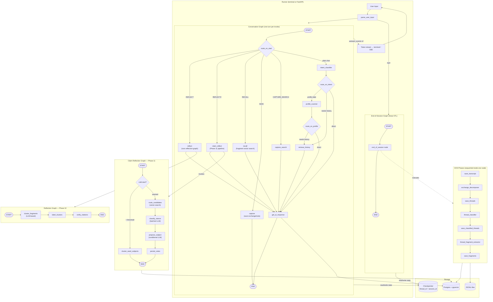

# Journal Agent

A LangGraph-based conversational journaling system with persistent memory, semantic retrieval, and an evolving insight layer. The agent maintains long-term context across sessions by extracting ideas from conversations, embedding them in a vector store, and synthesizing patterns into structured insights over time.

---

## What It Does

Each conversation session is a chat loop with an LLM. As you talk, the agent:

1. **Classifies your intent** — design, reflection, recall, or plain conversation
2. **Retrieves relevant fragments** from past sessions via vector search
3. **Generates a response** conditioned on retrieved history, active insights, and a user profile
4. **Persists the session** at `/quit` via an ETL pipeline that decomposes the transcript into searchable `Fragment` records

Between sessions, a **reflection graph** runs over unprocessed fragments to extract and refine cross-session insights using one of two strategies:

- **Phase 10** — cluster fragments with HDBSCAN, label clusters, verify insight citations
- **Phase 11** — maintain a live `Subject → Claim → Vote` model; each fragment votes for or against existing claims, and the LLM proposes new subjects when none fit

---

## Architecture



---

## Graph State

Both graphs share `JournalState` (a Pydantic `BaseModel` with LangGraph reducers):

| Field | Reducer | Description |
|---|---|---|
| `session_messages` | `add_messages` | Accumulates Human/AI messages within the turn |
| `transcript` | `add` | Exchange pairs appended each turn |
| `threads` / `classified_threads` | `add` | ThreadSegments from EOS decomposition |
| `retrieved_history` | replace | Fragments from vector search for the current turn |
| `latest_insights` | replace | Phase 10 Insight objects surfaced to the AI prompt |
| `claim_insights` | replace | Phase 11 SubjectSnapshot list surfaced to the AI prompt |
| `context_specification` | replace | Intent-classifier output: prompt key, retrieval config |
| `user_profile` | replace | Persistent user preferences and style |
| `user_command` / `status` | replace | Routing signals |

The `ReflectionState` is a separate, lighter schema shared by both reflection graphs.

---

## Data Model

```
Turn → Exchange → ThreadSegment → Fragment
                                      │
                          embedded by fastembed (all-MiniLM-L6-v2, 384-dim)
                          stored in Postgres + pgvector
                          searched by cosine similarity
```

**Phase 11 additions:**

```
Fragment ─── votes ──► Claim (versioned text)
                           │
                        Subject (label + embedding centroid)
                           │
                        traction = Σ vote.strength × sign(stance)
```

---

## Project Layout

```
journal_agent/
├── api/
│   ├── main.py          # FastAPI app — /sessions, /chat/{id}, DELETE /sessions/{id}
│   ├── models.py        # Pydantic request/response models + SSE event types
│   └── streaming.py     # graph_stream() — wraps astream_events → SSE
│
├── comms/
│   ├── commands.py      # parse_user_input → ParsedInput; build_turn_input
│   ├── human_chat.py    # terminal I/O: get_console_input, stream_ai_response_to_terminal
│   ├── llm_client.py    # thin wrapper: astream, astructured (structured output)
│   └── llm_registry.py  # builds LLMClient per role (conversation / classifier / extractor)
│
├── configure/
│   ├── config_builder.py  # tuning constants (cluster thresholds, batch sizes, etc.)
│   ├── context_builder.py # assembles the system prompt from profile + history + insights
│   ├── settings.py        # pydantic-settings: DB URL, API keys, model registry
│   ├── score_card.py      # ContextSpecification scoring; drives retrieval config per turn
│   └── prompts/           # one module per prompt key; get_prompt(key, state) dispatch
│
├── graph/
│   ├── journal_graph.py    # build_conversation_graph, build_end_of_session_graph
│   ├── reflection_graph.py # build_reflection_graph (Ph10), build_claim_reflection_graph (Ph11)
│   ├── routing.py          # _route_base, goto — shared routing helpers
│   ├── state.py            # JournalState, ReflectionState, WindowParams
│   └── nodes/
│       ├── classifiers.py         # intent_classifier, profile_scanner, exchange_decomposer, thread_classifier, thread_fragment_extractor
│       ├── eos_pipeline.py        # make_end_of_session_node — sequences 7 EOS phases
│       ├── insight_nodes.py       # Phase 10 + 11 node factories
│       └── stores.py              # save_transcript, save_threads, save_fragments, etc.
│
├── model/
│   ├── session.py   # Turn, Exchange, Fragment, ThreadSegment, ContextSpecification, UserProfile, ...
│   └── insights.py  # Insight, Subject, Claim, Vote, FragmentWorkItem, SubjectSnapshot
│
├── stores/
│   ├── pg_gateway.py        # PgGateway — psycopg3 pool, vector search, entity upserts
│   ├── embedder.py          # fastembed wrapper (all-MiniLM-L6-v2)
│   ├── fragment_repo.py     # FragmentRepository
│   ├── transcript_repo.py   # TranscriptRepository + TranscriptStore (in-session buffer)
│   ├── threads_repo.py      # ThreadsRepository
│   ├── insights_repo.py     # InsightsRepository
│   ├── subjects_repo.py     # SubjectsRepository — Phase 11 subject/claim/vote ops
│   ├── capture_repo.py      # CaptureRepository — named saves (/save command)
│   ├── profile_repo.py      # UserProfileRepository
│   ├── checkpointer.py      # make_postgres_checkpointer — LangGraph checkpoint pool
│   └── jsonl_gateway.py     # JSONL flat-file fallback for transcripts, threads, profile
│
├── evals/                   # eval fixtures, runner, and comparison utilities
├── tests/                   # pytest suite (unit + integration)
├── main.py                  # terminal runner — asyncio loop around the two graphs
└── telemetry.py             # LangSmith callback handler
```

---

## Runner Model

The key design decision: **the graph does not loop**. One graph invocation = one turn. The Python runner (terminal or FastAPI) owns the loop.

**Terminal (`main.py`):**
```
while True:
    user_input = get_console_input()
    parsed = parse_user_input(user_input)
    if parsed.quit: break
    events = conversation.astream_events(turn_input, config, version="v2")
    await stream_ai_response_to_terminal(events)
eos.ainvoke({}, config=config)
```

**FastAPI (`api/main.py`):**
- `POST /sessions` — allocate `session_id`, mark as needing first-turn bootstrap
- `POST /chat/{session_id}` — one turn, returns `StreamingResponse` (SSE)
- `DELETE /sessions/{session_id}` — trigger EOS pipeline
- Both runners use the same `build_conversation_graph` / `build_end_of_session_graph` factories

Token streaming uses `astream_events(version="v2")`, filtering for `on_chat_model_stream` events. The graph itself just accumulates chunks; the runner decides how to render them.

---

## Conversation Commands

| Command | Graph path | Effect |
|---|---|---|
| *(plain message)* | `intent_classifier → [profile_scanner] → [retrieve_history] → get_ai_response` | Standard turn |
| `/reflect` | `reflect → get_ai_response` | Runs Phase 10 reflection; narrates insights |
| `/reflect2` | `claim_reflect → get_ai_response` | Runs Phase 11 claim pipeline; narrates subject traction |
| `/recall <topic>` | `recall → get_ai_response` | Vector search over fragments; narrates matches |
| `/save [n] <topic>` | `capture → END` | Saves last n exchanges (or inline text) to captures table |
| `/capture <topic>` | `capture_search → get_ai_response` | Searches named captures |
| `/quit` | *(runner exits)* | Triggers end-of-session ETL |

---

## Storage

| Store | Purpose | Backend |
|---|---|---|
| Postgres + pgvector | Fragments, embeddings, threads, subjects, claims, votes, checkpointer | `psycopg3` + `pgvector` |
| JSONL files | Transcript archive, thread export, user profile | flat files in `data/` |
| LangGraph checkpointer | Per-session graph state keyed by `thread_id = session_id` | `langgraph-checkpoint-postgres` |

Embeddings use **fastembed** (`sentence-transformers/all-MiniLM-L6-v2`, 384-dim, ONNX — no GPU required). Similarity search is cosine via pgvector.

Write paths fan out to both Postgres and JSONL via dual-gateway repositories.

---

## LLM Roles

Three distinct roles are configured independently via `LLMRegistry`:

| Role | Nodes | Notes |
|---|---|---|
| `conversation` | `get_ai_response` | Main chat model; streams tokens |
| `classifier` | `intent_classifier`, `profile_scanner`, reflection nodes, stance classifier | Structured output via `.astructured()` |
| `extractor` | `thread_fragment_extractor` | Extracts Fragment text from thread segments |

Supported providers: OpenAI, Anthropic, Ollama. Configured via `.env` (`AI_ENV_FILE`).

---

## Setup

```bash
# Install dependencies (requires uv)
uv sync

# Database — run once
psql $POSTGRES_URL -f sql/schema.sql

# Environment
export AI_ENV_FILE=/path/to/.env
# .env needs: POSTGRES_URL, ANTHROPIC_API_KEY or OPENAI_API_KEY

# Terminal
uv run python -m journal_agent.main

# API server
uv run uvicorn journal_agent.api.main:app --reload
```

A React chat frontend lives in `journal_chat_app/` (Vite + React).

---

## Chat App

`journal_chat_app/` is a minimal Vite/React frontend that consumes the SSE stream from the FastAPI backend. It handles `token`, `system`, `done`, and `error` event types and renders streamed AI responses incrementally.

---

## Design Docs

| File | Topic |
|---|---|
| `design/goals.md` | Original motivation and key objectives |
| `design/components.md` | Component map and flow descriptions |
| `design/phase10-reflective-memory.md` | Cluster-based insight pipeline |
| `design/phase11-claim-based-insights.md` | Subject/claim/vote model design |
| `design/api-build-plan.md` | FastAPI architecture decisions |
| `design/context-builder.md` | Prompt assembly strategy |
| `sql/schema.sql` | Full Postgres schema |
